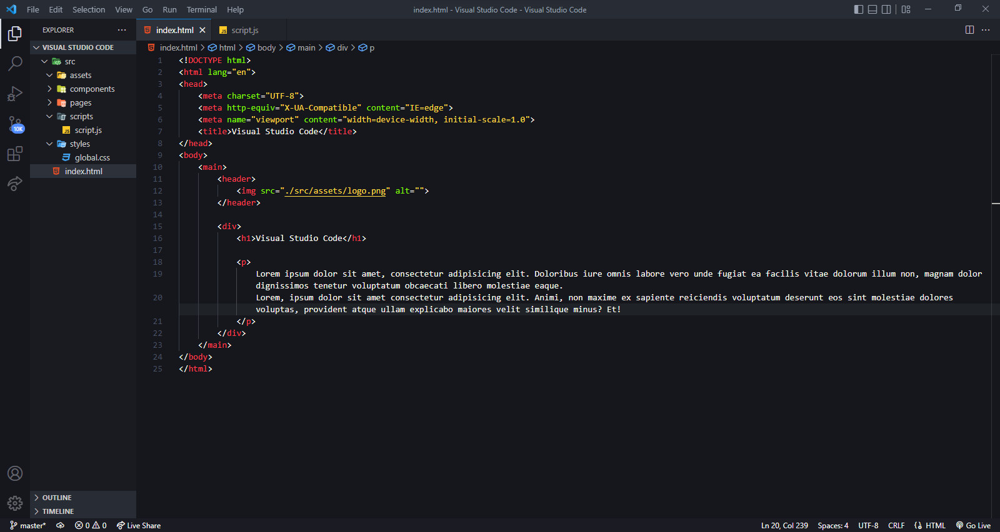
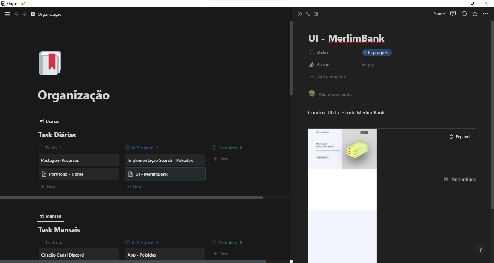
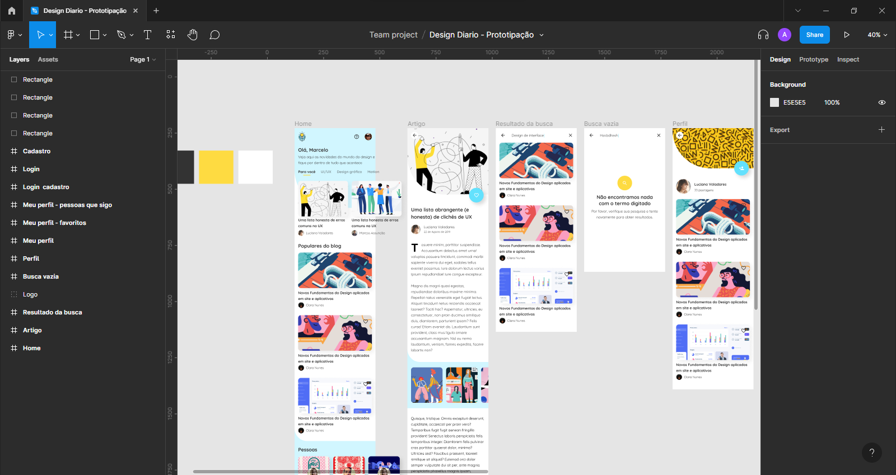
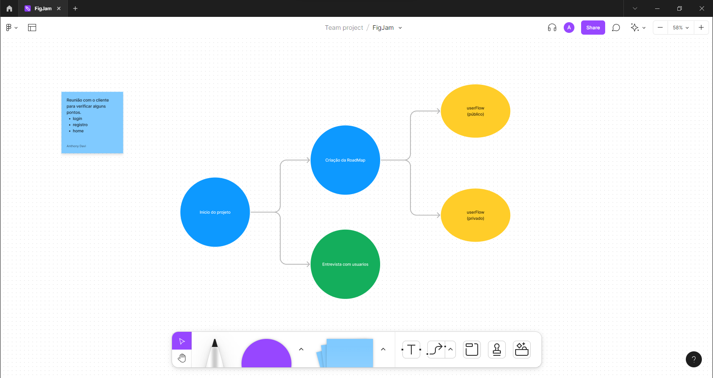
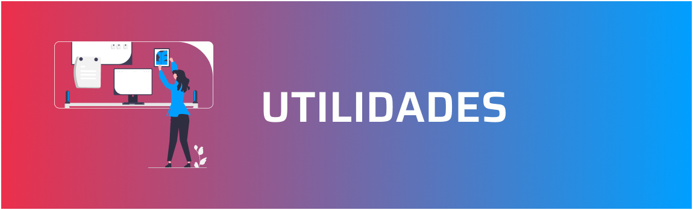

<h1 align="center">
📚
 
Ferramentas e utilidades para
 
DESENVOLVEDORES e DESIGNERS
</h1>

Sempre tive uma dúvida na hora de organizar a minha carreira como Desenvolvedor e UI Designer: <i>"Quais ferramentas, recursos, cursos eu devo escolher e fazer? Quais desse podem agilizar meu trabalh?"</i>

Com esse pensamento, resolvi criar este repósitorio para auxiliar os novos profissionais que também tem ou terão essa dúvida.

Está é uma grande seleção de ferramenta que julgo serem as melhores para te auxiliar nessa jornada, baseados na minha experiencia e na experiencia de outros profissionais que tive contato.

> A maior parte do conteúdo aqui será totalmente GRATUITO, salvo alguma exeção que avisarei mas sempre com alternativas gratuitas.

---

> Todo desenvolvedor e designer que se prese além de conhecimento profundo na sua área necessita de boas ferramentas, afinal você prefere cortar uma árvore com um machado ou uma faca de mesa?
> Baseado nisso aqui uma seleção de ferramentas para implementar na sua carreira:

<h2 align="center">Visual Studio Code</h2>

Sem sombra de dúvidas o melhor editor de código atualmente, unanime entre os desenvolvedores, por ser leve e poderoso principalmente aliado as diversas extensões de produtividade e customização.
Nenhuma aplicação é pequena ou grande demais para esse editor e seus recursos, mantido pela Microsoft este é o melhor editor de código gratuito do mercado.

🌐 [Visual Studio Code](https://code.visualstudio.com/) 

> Uma seleção de algumas extensões para o seu Visual Studio Code [AQUI](pages/extensoes.md)

<h2 align="center">Notion</h2>

Aliado a um bom profissional a organização e documentação de todos os seus projetos é essencia e o Notion é a melhor ferramenta nesse quesito.
Tendo a possibilidade de criar diversas páginas e subpaginas, usar templates prontos e criar os seus e com a disponibildiade em diversos dispositivos está é a melhor ferramenta de organização e documentação.

🌐 [Notion](https://www.notion.so/product) 

> ⚠️ Alguns recursos do Notion são pagos mas o plano gratuito já possui recursos suficientes para o uso pessoal.

<h2 align="center">Figma</h2>

Antes de começar a codar uma aplicação, deve-se haver um planejamento para que surpresas não aconteçam durante o processo e para que o cliente e o programador tenham conhecimento do que irá e como irá acontecer.
Assim o Figma surge como a melhor ferramenta de prototipação de interface, aliada com diversos plugins e uma comunidade ativa, o Figma ganha destaque em relação as outras ferramentas do tipo.

> Uma seleção de alguns plugins para o seu Figma [AQUI](pages/plugins.md)

> ⚠️ Alguns recursos do Figma são pagos mas o plano gratuito já possui recursos suficientes para o uso pessoal.

🌐 [Figma](https://www.figma.com/ui-design-tool/) 

<h2 align="center">FigJam</h2>

Aliado ao Figma como ferramenta de prototipação e ao Notion como ferramenta de documentação e organiazação, temos o FigJam, mantido dentro do proprio Figma o FigJam é uma poderosa ferramenta para criação de worflow e organização de idéias, perfeira para Brainstorming

> ⚠️ Alguns recursos do FigJam são pagos mas o plano gratuito já possui recursos suficientes para o uso pessoal.

🌐 [Figma](https://www.figma.com/ui-design-tool/) 

---

> Quando estiver desenvolvendo uma aplicação você irá se deparar com a necessidade de obter alguns recursos, como ícones, iamgens ou alguma ferramenta de auxilio.
> Aqui uma seleção com diversas utilidades.

### Índice

[📌 Imagens](pages/utilidadeds.md) 
[📌 Ilustrações](pages/utilidadeds.md) 
[📌 Ícones](pages/utilidadeds.md) 
[📌 Paletas de Cores](pages/utilidadeds.md) 
[📌 Fontes](pages/utilidadeds.md) 
[📌 Geradores](pages/utilidadeds.md) 
[📌 Repositorios Utéis](pages/utilidadeds.md) 

---

## ☕ Seja um contribuidor desse projeto

Quer fazer parte desse projeto e me ajudar expandindo e atualizando os conteudos? Clique [AQUI](pages/contribuicoes.md)

