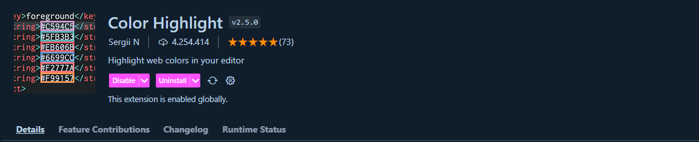
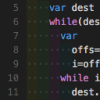

 [🔙 Voltar ao início](../README.md) 

> O Visual Studio Code é o mais poderoso editor de código gratuito que todo desenvolvedor tem a sua disposição.
> Com uma grande variedade de extensões que podem aumentar muito a sua produtividade a disposição de todos. Aqui, uma seleção das melhores extenções com foco na produtividade.

---

### Live Server

Essa extensão irá criar um servidor local com atualização instantanea, perfeito para quando você estiver desenvolvendo algum site e não precisar atualizar manualmente a página.

[Instalar Live Server](https://marketplace.visualstudio.com/items?itemName=ritwickdey.LiveServer)

---

### Color Highlight

Quando você digitar algum código de cor (Ex: #F3D200) essa extensão irá identificar a cor e exibi-la no editor de código para uma melhor visualização.

[Instalar Color Hightlight](https://marketplace.visualstudio.com/items?itemName=naumovs.color-highlight)

---

### Live Share

Quando você precisar de ajuda com um código de forma remota o Live Share permite que duas pessoas possam trabalhar no mesmo código de forma eficiente.

[Instalar Live Share](https://marketplace.visualstudio.com/items?itemName=MS-vsliveshare.vsliveshare)

---

### Prettier 

Poderosa extensão que formata automaticamente o seu código, isso é otimo para manter um padrão de formatação em todo trabalho.

[Instalar Prettier](https://marketplace.visualstudio.com/items?itemName=esbenp.prettier-vscode)

---

### Rainbow Brackets

Essa extensão adicionará cores aos os parenteses, colchetes e chaves ((), [], {}) assim você terá uma melhor visualização do códigos e saberá ao certo onde começa e termina cada bloco de código.

[Instalar Rainbow Brackets](https://marketplace.visualstudio.com/items?itemName=2gua.rainbow-brackets)

---

### CodeSnap

Caso você precise tranformar o seu código em imagem para alguma divulgação ou coisa do tipo, o CodeSnap fará isso dá melhor forma.

[Instalar CodeSnap](https://marketplace.visualstudio.com/items?itemName=adpyke.codesnap)

---

### Intellicode

O Intellicode irá te ajudar dando sugestões de preenchimento de código conforme a linguagem que você estiver utilizando.

[Instalar IntelliCode](https://marketplace.visualstudio.com/items?itemName=VisualStudioExptTeam.vscodeintellicode)

---

### indent-rainbow

Essa extensão irá adicionar cores a identação do seu código para uma melhor visualização dos blocos semparadamente.

[Instalar indent-rainbow](https://marketplace.visualstudio.com/items?itemName=oderwat.indent-rainbow)

---

### Markdown Preview Enhanced

Quando for excrever o README ou qualquer markdown (.md) no seu código essa extenção irá te proporcionar uma visualização do que você está fazendo.

[Instalar Markdown Preview Enhanced](https://marketplace.visualstudio.com/items?itemName=shd101wyy.markdown-preview-enhanced)

---

